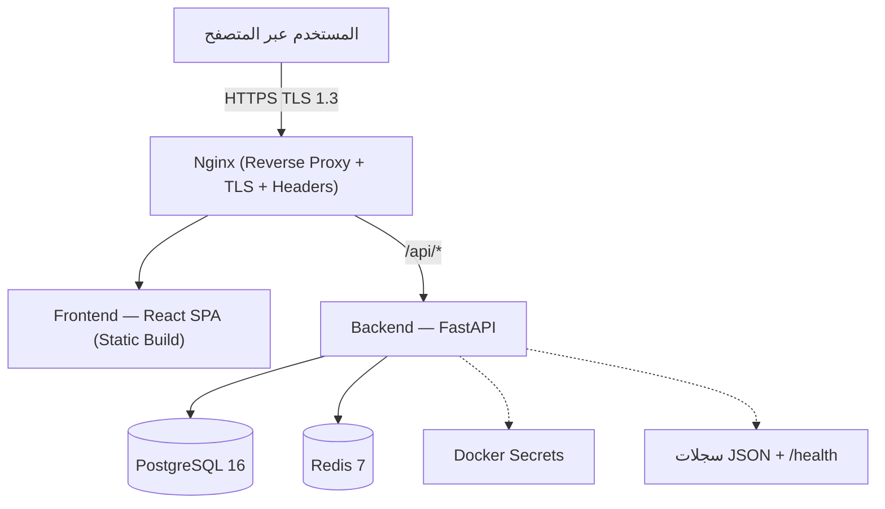
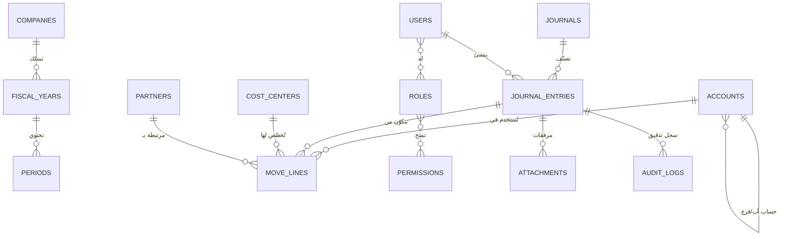
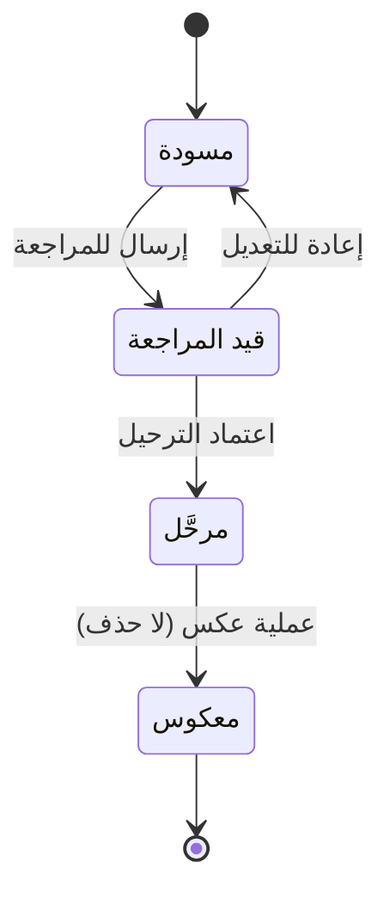

# نظام الحسابات الاحترافي — مؤسسة الجسر المصري للإعلام والتنمية

> وثيقة متطلبات وتصميم تقني (SRS + TDD) لنظام محاسبة مؤسسي بالقيد المزدوج، يعمل على Docker، بواجهة عربية كاملة (RTL)، وتصميم مستوحى من هوية Claude.

| الحقل | القيمة |
|---|---|
| **اسم المشروع** | نظام الحسابات الاحترافي |
| **الجهة المستفيدة** | مؤسسة الجسر المصري للإعلام والتنمية |
| **الإصدار** | 2.0 — نسخة موسّعة وجاهزة للاعتماد |
| **نوع الوثيقة** | متطلبات وتصميم تقني (Software Requirements + Technical Design) |
| **الحالة** | مسودة نهائية — بانتظار اعتماد الجهة المستفيدة |
| **آخر تحديث** | 16 سبتمبر 2026 |

## جدول المحتويات

0. [الملخص التنفيذي](#0-الملخص-التنفيذي)
1. [الأهداف والنطاق](#1-الأهداف-والنطاق)
2. [أصحاب المصلحة والأدوار](#2-أصحاب-المصلحة-والأدوار)
3. [المعمارية التقنية](#3-المعمارية-التقنية)
4. [تصميم قاعدة البيانات](#4-تصميم-قاعدة-البيانات)
5. [الصفحات والموديولات](#5-الصفحات-والموديولات)
6. [التكامل والامتثال المصري](#6-التكامل-والامتثال-المصري)
7. [الأمان](#7-الأمان)
8. [نظام التصميم (هوية Claude)](#8-نظام-التصميم-هوية-claude)
9. [المتطلبات غير الوظيفية](#9-المتطلبات-غير-الوظيفية)
10. [استراتيجية الاختبار](#10-استراتيجية-الاختبار)
11. [CI/CD وإدارة الإصدارات](#11-cicd-وإدارة-الإصدارات)
12. [النشر والتشغيل](#12-النشر-والتشغيل)
13. [سجل المخاطر](#13-سجل-المخاطر)
14. [خارطة الطريق](#14-خارطة-الطريق)
15. [معايير القبول والتسليم](#15-معايير-القبول-والتسليم)
16. [الملحقات](#16-الملحقات)

---

## 0. الملخص التنفيذي

يهدف المشروع إلى بناء **نظام محاسبة مؤسسي** بالقيد المزدوج لمؤسسة الجسر المصري للإعلام والتنمية، يحل محل الأدوات اليدوية (جداول بيانات/دفاتر ورقية) بمنصة رقمية موحّدة، آمنة، وقابلة للتدقيق، تُشغَّل ذاتيًا (Self-hosted) عبر Docker دون الاعتماد على خدمات سحابية خارجية للبيانات المالية الحساسة.

**القيمة المضافة الرئيسية:**
- ثوابت محاسبية مضمونة داخل قاعدة البيانات نفسها (توازن القيد، عدم حذف المرحَّل)، لا تعتمد فقط على منطق التطبيق.
- سجل تدقيق كامل غير قابل للتعديل لكل حركة مالية، بما يخدم الشفافية أمام مجلس الإدارة والجهات الرقابية والممولين.
- تقارير مالية جاهزة (ميزانية، دخل، تدفقات نقدية) قابلة للتصدير خلال دقائق بدل أيام من التجميع اليدوي.
- بنية تحتية معزولة بالكامل (لا منافذ قاعدة بيانات مكشوفة، أسرار مُدارة، نسخ احتياطي مشفّر) تناسب طبيعة البيانات المالية الحساسة لمؤسسة أهلية.

**الإصدار الأول (v1)** يغطي النواة المحاسبية الكاملة والتقارير الأساسية ومراكز التكلفة باللغة العربية والجنيه المصري فقط؛ أما التوسعات (تعدد العملات، تكامل الفاتورة الإلكترونية، الأصول الثابتة، الموازنات التخطيطية) فمؤجّلة إلى إصدارات لاحقة (v2+) كما هو موضّح في قسم النطاق.

هذه الوثيقة تُلزم الفريق التقني بحدود تنفيذية واضحة (بنية البيانات، القيود الصارمة، معايير الأمان، معايير القبول) بحيث يصبح أي انحراف عنها قرارًا صريحًا موثقًا وليس تسرّبًا صامتًا في النطاق.

---

## 1. الأهداف والنطاق

### 1.1 الهدف العام
توفير نواة محاسبية صلبة (Core Ledger) + التقارير المالية الرئيسية + مراكز التكلفة، بجودة احترافية تنافس الحلول المحاسبية المؤسسية (مثل Odoo Accounting)، مع سيادة كاملة على البيانات (Data Sovereignty) عبر استضافة ذاتية.

### 1.2 مؤشرات نجاح مقترحة (تُعتمد مع الجهة المستفيدة قبل البدء)
| المؤشر | الهدف المقترح |
|---|---|
| زمن إقفال الفترة الشهرية | خلال يوم عمل واحد بعد اكتمال الإدخال |
| زمن توليد تقرير الميزانية العمومية | أقل من 5 ثوانٍ لحجم بيانات سنة كاملة |
| نسبة القيود المرفوضة تلقائيًا لعدم التوازن | 100% (لا يمر أي قيد غير متزن) |
| توفر النظام (Availability) | 99% خلال ساعات العمل الرسمية |
| زمن الاستعادة من نسخة احتياطية (RTO) | أقل من 4 ساعات |

### 1.3 نطاق الإصدار الأول (In Scope — v1)
- اللغة: عربية بالكامل (RTL) — العملة: الجنيه المصري (EGP) فقط.
- شركة واحدة (Single Company) في قاعدة البيانات، مع تصميم مرن يسمح بالتوسع لاحقًا لتعدد الشركات.
- شجرة حسابات، دفاتر يومية، قيود، ترحيل، فترات مالية، مراكز تكلفة، شركاء (عملاء/موردون/جهات مانحة).
- التقارير الأساسية: ميزان المراجعة، الأستاذ العام، اليومية الأمريكية، الميزانية العمومية، قائمة الدخل، التدفقات النقدية.
- مصادقة آمنة (Argon2id + JWT + 2FA) وصلاحيات (RBAC).
- نشر عبر Docker Compose على خادم واحد (On-Premise أو VPS خاص).

### 1.4 خارج النطاق للإصدار الأول (Out of Scope — مؤجَّل إلى v2+)
| الميزة | السبب/الملاحظة |
|---|---|
| تعدد العملات | يُضاف بعد استقرار النواة أحادية العملة لتفادي تعقيد فروق التقييم مبكرًا |
| تعدد الشركات (Multi-company Consolidation) | البنية تدعمه مستقبلًا، لكن التنفيذ الكامل (تجميع/إلغاء عمليات بينية) مؤجَّل |
| الأصول الثابتة والإهلاك | موديول منفصل يُبنى على نفس النواة لاحقًا |
| الموازنات التخطيطية (Budgeting) ومقارنة الفعلي بالمخطط | يحتاج نموذج بيانات إضافي (بنود موازنة) |
| الرواتب والأجور | نظام منفصل عادةً، يُدمج عبر قيد يومية مُصدَّر لا عبر بناء موديول رواتب كامل |
| تكامل الفاتورة الإلكترونية/الإيصال الإلكتروني (منظومة مصلحة الضرائب المصرية) | مرتبط بطبيعة نشاط المؤسسة الضريبي؛ يُحدَّد لاحقًا هل تخضع المؤسسة لإلزامية الفوترة الإلكترونية، ثم يُبنى كموديول تكامل API (انظر قسم 6) |
| تطبيق موبايل مخصص | الواجهة الويب متجاوبة (Responsive) وتغطي الاحتياج في v1 |

### 1.5 المستخدمون المستهدفون
عدد مستخدمين متوقع صغير إلى متوسط (تُقدَّر الحاجة مع الجهة المستفيدة، إرشاديًا 5–20 مستخدمًا): مدير مالي، محاسب/أكثر من محاسب، مراجع داخلي، مدير تنفيذي (اطّلاع فقط على التقارير).

---

## 2. أصحاب المصلحة والأدوار

| الدور | المسؤولية الرئيسية | نوع الاطّلاع في النظام |
|---|---|---|
| **مجلس الإدارة / المدير التنفيذي** | اعتماد التقارير المالية، مراجعة الأداء | مشاهد (Viewer) للتقارير فقط |
| **المدير المالي** | اعتماد الترحيل، إقفال الفترات، إدارة الصلاحيات | مدير (Admin) |
| **المحاسب** | إدخال القيود، مطابقة الحسابات | محاسب (Accountant) |
| **المراجع الداخلي/الخارجي** | مراجعة القيود قبل الترحيل، فحص سجل التدقيق | مراجع (Auditor) — قراءة + اعتماد مراجعة |
| **مسؤول تقنية المعلومات** | التشغيل، النسخ الاحتياطي، الأمان، الترقيات | وصول بنية تحتية (خارج تطبيق المحاسبة) |

> **RACI مختصر لقرارات النطاق:** الجهة المستفيدة (R/A) تعتمد أي تغيير في النطاق أو الأولويات؛ الفريق التقني (R) ينفّذ ويقترح البدائل التقنية؛ مسؤول تقنية المعلومات بالمؤسسة (C) يُستشار في قرارات الاستضافة والنسخ الاحتياطي.

---

## 3. المعمارية التقنية

### 3.1 المكوّنات والإصدارات

| الطبقة | التقنية | ملاحظات |
|---|---|---|
| الواجهة | React 18 + TypeScript + Vite + Tailwind CSS (RTL) | SPA، تحميل كسول للصفحات (Lazy Loading) |
| الخادم | FastAPI + SQLAlchemy 2.0 + Alembic (ترحيلات) | توثيق تلقائي عبر OpenAPI/Swagger على `/api/docs` (مقيَّد بصلاحيات في الإنتاج) |
| قاعدة البيانات | PostgreSQL 16 | `NUMERIC(18,2)` لكل الحقول المالية (لا `float` إطلاقًا) |
| الوسيط | Redis 7 (جلسات / تخزين مؤقت / Rate limiting / طابور مهام) | |
| المهام الخلفية | FastAPI Background Tasks (v1) → قابل للترقية إلى Celery/RQ عند الحاجة لتوليد تقارير ثقيلة أو نسخ احتياطي غير متزامن | |
| البروكسي | Nginx (TLS 1.3 + HSTS + Security Headers) | تجديد شهادات تلقائي (Certbot/Let's Encrypt أو شهادة مؤسسية) |
| المراقبة والسجلات | سجلات JSON منظّمة + نقطة `/health` لكل حاوية + تتبّع أخطاء (Sentry ذاتي الاستضافة أو مكافئ) | اختياري في v1، مُوصى به قبل الإنتاج |
| النشر | Docker Compose (شبكة معزولة + Docker secrets + volumes مسمّاة) | بيئات منفصلة: Development / Staging / Production |

الحاويات: `db` · `backend` · `frontend` · `nginx` · `redis` — جميعها مع `healthcheck` وسياسة `restart: unless-stopped`، وبدون تعريض أي منفذ لقاعدة البيانات أو Redis خارج الشبكة الداخلية لـ Docker.

### 3.2 مخطط المعمارية



### 3.3 مبادئ تصميم الـ API
- REST مبني على الموارد (`/api/v1/journal-entries`, `/api/v1/accounts`, …)، مع ترقيم إصدار صريح في المسار لدعم التوافق الخلفي عند التطوير المستقبلي.
- كل نقطة نهاية (Endpoint) محمية بـ RBAC على مستوى الراوت، وتُدقَّق مدخلاتها عبر Pydantic (خادم) وZod (واجهة) بنفس المخطط منطقيًا لتفادي التباين.
- الاستعلامات الثقيلة (تقارير) تدعم Pagination/Streaming لتفادي إغراق الذاكرة عند بيانات سنوات طويلة.

### 3.4 البيئات
| البيئة | الغرض | ملاحظة |
|---|---|---|
| Development | تطوير محلي | بيانات وهمية (Seed Data)، لا بيانات حقيقية إطلاقًا |
| Staging | اختبار قبول قبل الإنتاج | نسخة من هيكل الإنتاج ببيانات تجريبية مُقنَّعة |
| Production | التشغيل الفعلي | نسخ احتياطي، مراقبة، وصول مقيَّد بـ VPN/IP allowlist لواجهة الإدارة |

---

## 4. تصميم قاعدة البيانات

### 4.1 مخطط العلاقات (ERD مبسّط)



### 4.2 الجداول الرئيسية (موسَّعة)

| الجدول | أهم الحقول | ملاحظات تصميم |
|---|---|---|
| `companies` | الاسم، الشعار، السجل الضريبي، بداية السنة المالية | جدول واحد فعليًا في v1، لكنه موجود لدعم تعدد الشركات مستقبلًا |
| `accounts` | `code`, `parent_id`, `level (1..4)`, `type`, `is_active` | كود هرمي تلقائي (`1` / `1.1` / `1.1.1`)، `is_active=false` بدل الحذف |
| `journals` | `type` (عام/نقدي/بنكي/مبيعات/مشتريات/افتتاحي)، `default_account_id` | |
| `fiscal_years` / `periods` | تواريخ البداية/النهاية، `is_closed` | لا يمكن ترحيل قيد بتاريخ يقع في فترة `is_closed=true` |
| `journal_entries` | رقم تسلسلي **فريد لكل سنة مالية**، المرجع، التاريخ، `status` (مسودة/قيد المراجعة/مرحَّل/معكوس) | الرقم التسلسلي لا يُعاد استخدامه حتى لو أُلغيت مسودة |
| `move_lines` | `account_id`, `debit`, `credit` (`NUMERIC(18,2)`), `cost_center_id`, `partner_id` | فهرس مركّب على `(account_id, entry_date)` لتسريع كشف الحساب |
| `partners` | نوع (عميل/مورد/جهة مانحة)، بيانات تواصل، رقم ضريبي | |
| `cost_centers` | اسم، كود، حالة | |
| `users` / `roles` / `permissions` | تجزئة Argon2id لكلمة المرور، `totp_secret` مشفّر | لا يُخزَّن أي كلمة مرور كنص صريح تحت أي ظرف |
| `audit_logs` | `actor_id`, `action`, `entity`, `before`, `after`, `timestamp`, `ip_address` | جدول Append-only (بلا صلاحية UPDATE/DELETE حتى لمستخدم الـ DB) |
| `attachments` | مسار التخزين، نوع الملف، حجم، فحص محتوى | لا تُحفَظ الملفات داخل الجدول نفسه؛ تُخزَّن على القرص/volume مع مسار مرجعي |
| `settings` | إعدادات عامة (شعار، اسم، تنسيقات) | |

### 4.3 القيود الصارمة (على مستوى قاعدة البيانات، لا التطبيق فقط)

```sql
-- على مستوى سطر الحركة
CHECK (debit >= 0 AND credit >= 0)
CHECK (debit = 0 OR credit = 0)          -- لا يجتمع مدين ودائن في نفس السطر

-- على مستوى القيد ككل (يُنفَّذ عبر Trigger أو ضمن المعاملة قبل تغيير status إلى 'posted')
-- يُرفض الترحيل إذا: SUM(debit) <> SUM(credit) لنفس journal_entry_id
```

- الترحيل يتم ضمن معاملة قاعدة بيانات واحدة (Transaction) تُرفَض بالكامل إذا `Σdebit ≠ Σcredit` — لا ترحيل جزئي أبدًا.
- قفل الفترات المالية المغلقة يُطبَّق كـ Trigger على `journal_entries`/`move_lines`، وليس فقط كتحقق في واجهة التطبيق، لسدّ أي مسار تحايل عبر استدعاء API مباشر.
- **لا حذف فعلي (Hard Delete)** لأي قيد مرحَّل تحت أي صلاحية — الإجراء الوحيد هو **قيد عكسي (Reversal Entry)** يُنشئ حركة معاكسة مرتبطة بالقيد الأصلي، فيبقى الأثر التاريخي كاملًا للتدقيق.
- الترقيم التسلسلي للقيود يُولَّد داخل قاعدة البيانات (Sequence لكل سنة مالية) لمنع الفجوات أو التكرار حتى مع تزامن عدة مستخدمين.

### 4.4 الفهرسة والأداء
فهارس مقترحة كحد أدنى: `move_lines(account_id, entry_date)`، `move_lines(cost_center_id)`، `journal_entries(fiscal_year_id, sequence_number)` (فريد)، `audit_logs(entity, entity_id)`. تُراجَع خطط الاستعلام (`EXPLAIN ANALYZE`) لتقارير الميزانية العمومية وميزان المراجعة تحديدًا لأنها تجمع بيانات سنة كاملة.

---

## 5. الصفحات والموديولات

### 5.1 شجرة الحسابات (المستوى 1→4)
شجرة قابلة للطي/التوسع، أكواد هرمية تلقائية (`1` / `1.1` / `1.1.1`)، تعطيل بدل الحذف، نوع الحساب يحدد موضعه في الميزانية (أصول/خصوم/حقوق ملكية تظهر في الميزانية العمومية، إيرادات/مصروفات في قائمة الدخل).

### 5.2 القيود اليومية (صفحة الإدخال اليومي)
إدخال متعدد الأسطر، تحقق لحظي (Client-side) من توازن مدين/دائن قبل الإرسال (مع إعادة تحقق إلزامية على الخادم)، قوالب قيود متكررة، مرفقات (مع فحص نوع/حجم الملف)، وسير عمل بحالات واضحة:



### 5.3 صفحات المخرجات
- **ميزان المراجعة** — رصيد افتتاحي + حركة الفترة + رصيد ختامي + اختبار التوازن التلقائي (`Σأرصدة مدينة = Σأرصدة دائنة`) معروض بوضوح في أعلى الصفحة.
- **اليومية الأمريكية** — قيود اليومية بأعمدة مدين/دائن مع المجاميع الفرعية والكلية، وإمكانية الفلترة بالفترة/الدفتر.
- **الأستاذ العام** — كشف حركة كل حساب مع الرصيد الجاري (Running Balance) وربط مباشر بالقيد المصدر.

### 5.4 التقارير
1. **الميزانية العمومية** — أصول/خصوم/حقوق ملكية + اختبار `الأصول = الخصوم + حقوق الملكية` معروض كتنبيه فوري عند أي اختلال.
2. **قائمة الدخل** — إيرادات/مصروفات لفترة محددة مع مقارنة اختيارية بالفترة السابقة.
3. **التدفقات النقدية** — تصنيف تشغيلي/استثماري/تمويلي.
4. **ميزان المراجعة حسب مركز التكلفة** — لدعم متابعة المشاريع/البرامج، وهو أمر شائع الأهمية للمؤسسات الأهلية والممولين.
5. كشف حساب الشريك (عميل/مورد/جهة مانحة) + تقرير شجرة الحسابات + دفتر اليومية الكامل.
- تصدير **PDF/Excel/CSV** لكل التقارير، مع صلاحيات مستقلة لكل تقرير (قد يسمح لدور معيّن بالاطّلاع دون التصدير مثلًا).

### 5.5 تسجيل الدخول الآمن
Argon2id لتجزئة كلمات المرور + JWT قصير العمر مع Refresh Token مدوَّر (httpOnly Secure Cookie) + **2FA (TOTP)** إلزامي للأدوار الإدارية واختياري لباقي الأدوار + قفل الحساب بعد محاولات فاشلة متكررة + Rate limiting على مستوى IP والحساب معًا.

### 5.6 الإعدادات
اسم/شعار المؤسسة · النسخ الاحتياطي المشفَّر (تلقائي مجدوَل + يدوي + استعادة تجريبية دورية) · التصفير الآمن (تأكيد مزدوج + أرشفة إلزامية قبل التنفيذ) · الرصيد الافتتاحي للبنوك والصناديق (يُولَّد كقيد افتتاحي آلي وليس تعديلًا مباشرًا للأرصدة) · إدارة المستخدمين والأدوار · إدارة السنوات المالية وإقفالها.

---

## 6. التكامل والامتثال المصري

هذا القسم إضافة مقترحة تخص طبيعة عمل المؤسسة داخل مصر، ويُوصى بمراجعته مع مستشار ضريبي/قانوني قبل الالتزام بجدول زمني تنفيذي، لأن الأنظمة الحكومية تُحدَّث دوريًا:

- **منظومة الفاتورة الإلكترونية والإيصال الإلكتروني** (مصلحة الضرائب المصرية): إن كانت المؤسسة خاضعة لإلزامية الإصدار الإلكتروني للفواتير/الإيصالات، يُبنى موديول تكامل منفصل (لاحقًا، v2) يرسل مستندات البيع/الشراء عبر API الجهة الرسمية، مع الاحتفاظ بالتوقيع الإلكتروني والاستجابة (UUID/QR) كمرفق على القيد المرتبط. لا يُدرَج هذا في v1 حتى يُحدَّد وضع المؤسسة الضريبي بدقة.
- **قانون حماية البيانات الشخصية المصري (رقم 151 لسنة 2020):** بيانات الشركاء (أسماء، أرقام هواتف، بيانات ضريبية) تُعامَل كبيانات شخصية؛ يُراعى الحد الأدنى من جمع البيانات، وتحديد صلاحية الاطّلاع، وسياسة احتفاظ وحذف واضحة لبيانات الشركاء غير النشطين، بما يتسق مع سجل التدقيق غير القابل للحذف للحركات المالية نفسها (الفصل بين "بيانات الشخص" القابلة للتصحيح/الحذف حسب الطلب، و"القيد المحاسبي" غير القابل للحذف).
- **مدة الاحتفاظ بالمستندات المحاسبية:** الممارسة المحاسبية والضريبية في مصر تستوجب عادة الاحتفاظ بالدفاتر والمستندات لعدة سنوات (يُنصح بالتأكد من المدة الدقيقة المطبَّقة على نشاط المؤسسة مع محاسب قانوني)؛ سياسة النسخ الاحتياطي والأرشفة (قسم 12) يجب أن تُصمَّم بما لا يقل عن هذه المدة.

---

## 7. الأمان

- **الشبكة:** HTTPS فقط + HSTS، شبكة Docker معزولة، لا تعريض منافذ قاعدة البيانات أو Redis للخارج، جدار حماية على مستوى الخادم يسمح فقط بمنفذي 443/22 (والأخير مقيَّد بـ IP محدد إن أمكن).
- **المصادقة:** Argon2id، JWT قصير العمر + Refresh مدوَّر، `SameSite=Strict`، 2FA (TOTP).
- **التفويض:** RBAC (مدير/محاسب/مراجع/مشاهد) + صلاحيات دقيقة على مستوى كل تقرير وكل إجراء (عرض/إنشاء/ترحيل/تصدير).
- **الإدخال:** تحقق صارم عبر Pydantic (خادم) و Zod (واجهة)، ORM فقط دون أي SQL خام يقبل مدخلات مستخدم مباشرة، تنظيف وفحص أنواع/أحجام المرفقات قبل التخزين.
- **الحماية من هجمات الويب الشائعة:** CSRF tokens، Content-Security-Policy (CSP)، X-Frame-Options، Rate limiting على نقاط الدخول الحساسة، تهريب/تعقيم مخرجات (XSS escaping) في كل مكان يُعرَض فيه محتوى أدخله مستخدم.
- **حماية البيانات:** تشفير النسخ الاحتياطية أثناء التخزين، سجل تدقيق غير قابل للحذف أو التعديل، الأسرار (كلمات مرور DB، مفاتيح JWT) داخل Docker secrets وليس في متغيرات بيئة عادية أو داخل الكود.
- **إدارة الاعتماديات (Dependencies):** فحص دوري للثغرات في مكتبات الواجهة والخادم وصور الحاويات (مثل Dependabot أو أداة مماثلة)، مع سياسة تحديث دورية لا تنتظر اكتشاف حادثة.
- **دورة حياة الأسرار:** تدوير دوري لمفاتيح JWT وكلمات مرور الخدمات الداخلية، وإجراء موثّق لإبطال الجلسات فورًا عند الاشتباه في اختراق حساب.
- **خطة استجابة أولية للحوادث:** تحديد جهة اتصال مسؤولة، خطوات إيقاف الوصول المشتبه فيه، مراجعة سجل التدقيق لتحديد نطاق الأثر، قبل استئناف العمل الطبيعي.

---

## 8. نظام التصميم (هوية Claude)

- **الألوان:** خلفية `#FAF9F5` · حبر (نص أساسي) `#191919` · لون مميز كورال `#D97757` · حدود `#E5E3DA` · ويُضاف نظام ألوان دلالي: نجاح (أخضر)، تحذير (أصفر/كهرماني)، خطأ (أحمر) — يُستخدم حصرًا لحالات القيود (مرحَّل/مسودة/مرفوض) وتنبيهات عدم التوازن.
- **الخطوط:** Cairo / Tajawal + Noto Sans Arabic لعربية واضحة، مع خط Mono للأرقام والحسابات (Tabular figures) لضمان محاذاة الأعمدة المالية. مقياس مسافات ثابت على أساس 8px.
- **الأرقام والتواريخ:** أرقام غربية (Western digits: 0-9) مع تسميات عربية — وهي الممارسة الشائعة في التطبيقات المحاسبية العربية لسهولة القراءة والفرز — وتقويم ميلادي موحّد لكل التواريخ المحاسبية.
- **التنسيق:** RTL كامل بما يشمل عكس الأيقونات الاتجاهية (أسهم، تنقّل)، جداول أنيقة بأعمدة ثابتة العرض للأرقام، حالات فارغة (Empty States) واضحة بدل شاشات بيضاء، Skeletons أثناء التحميل بدل مؤشرات دوّارة فقط.
- **الوصولية:** توافق WCAG 2.2 AA، تنقّل كامل بلوحة المفاتيح لصفحة القيود (لأن المحاسبين يفضّلون الإدخال دون فأرة)، سمات ARIA على كل عنصر تفاعلي، تباين ألوان كافٍ للنصوص المالية الحرجة.

---

## 9. المتطلبات غير الوظيفية

| البُعد | المتطلب |
|---|---|
| **الأداء** | تحميل الصفحة الرئيسية < 2 ثانية على شبكة عادية؛ توليد تقرير سنة كاملة < 5 ثوانٍ |
| **قابلية التوسع** | خادم واحد كافٍ لـ v1 (حتى ~20 مستخدمًا متزامنًا)؛ البنية (Docker Compose) قابلة للترحيل لاحقًا إلى Kubernetes/عدة خوادم دون إعادة تصميم النواة |
| **التوفر** | 99% خلال ساعات العمل، مع نافذة صيانة مجدولة معلنة مسبقًا لأي تحديث يتطلب توقفًا |
| **التوافق مع المتصفحات** | أحدث إصدارين من Chrome / Edge / Firefox / Safari — لا دعم لـ Internet Explorer |
| **الاستجابة (Responsive)** | يعمل بشكل كامل على أجهزة سطح المكتب والأجهزة اللوحية؛ الجوال يدعم الاطّلاع على التقارير كحد أدنى |
| **النسخ الاحتياطي والاستعادة** | RPO (أقصى فقدان بيانات مقبول) ≤ 24 ساعة، RTO (زمن الاستعادة) ≤ 4 ساعات |
| **اللغة** | عربية 100% في واجهة المستخدم، بما في ذلك رسائل الأخطاء والتحقق |

---

## 10. استراتيجية الاختبار

| المستوى | النسبة التقريبية من الجهد | الأدوات |
|---|---|---|
| اختبارات الوحدة (Unit) | ~50% | Pytest (خادم)، Vitest (واجهة) |
| اختبارات التكامل (Integration) | ~30% | Pytest + قاعدة بيانات اختبار معزولة |
| اختبارات الثوابت المحاسبية | إلزامية ومنفصلة | حالات: قيد غير متزن يُرفض، قيد في فترة مقفلة يُرفض، محاولة حذف قيد مرحَّل تُرفض، الميزانية العمومية متوازنة دائمًا |
| اختبارات شاملة (E2E) | ~20% | Playwright — تغطي رحلة كاملة: إنشاء قيد → مراجعة → ترحيل → ظهوره في ميزان المراجعة والتقارير |

هدف تغطية الكود (Coverage) المقترح: 80% كحد أدنى على منطق الترحيل والتقارير تحديدًا (أعلى أولوية من تغطية الواجهة الشكلية). CI يمنع الدمج (Merge) في الفرع الرئيسي عند فشل أي اختبار أو انخفاض التغطية عن الحد المتفق عليه.

مرحلة **اختبار قبول المستخدم (UAT)** مع فريق المحاسبة الفعلي في المؤسسة قبل الانتقال إلى الإنتاج، باستخدام بيانات تاريخية حقيقية (أو صورة مُقنَّعة منها) للتأكد من تطابق الأرصدة الافتتاحية والتقارير مع السجلات الحالية.

---

## 11. CI/CD وإدارة الإصدارات

- **الأنابيب (Pipeline):** فحص الأنماط (Lint) → فحص الأنواع (TypeScript/mypy) → اختبارات الوحدة والتكامل → بناء صور Docker → فحص أمني للصور والاعتماديات → نشر تلقائي إلى Staging → موافقة يدوية → نشر إلى Production.
- **استراتيجية الفروع:** فرع رئيسي (`main`) محمي لا يُدمَج فيه إلا عبر Pull Request باجتياز كل الفحوصات؛ فروع ميزات قصيرة العمر.
- **الإصدارات:** ترقيم دلالي (Semantic Versioning: `MAJOR.MINOR.PATCH`) مع سجل تغييرات (`CHANGELOG.md`) لكل إصدار يُنشر على الإنتاج.
- **ترحيلات قاعدة البيانات (Alembic):** كل تغيير في المخطط يمر عبر ملف ترحيل مُراجَع، قابل للتراجع (Downgrade)، ويُختبر على نسخة من بيانات Staging قبل التطبيق على الإنتاج.

---

## 12. النشر والتشغيل

### 12.1 التشغيل الأساسي
```bash
cp .env.example .env
docker compose up -d        # تشغيل كل الحاويات
docker compose logs -f      # المتابعة اللحظية للسجلات
```

### 12.2 النسخ الاحتياطي والاستعادة
- **الجدولة المقترحة:** نسخة يومية كاملة (تُحتفَظ بها 30 يومًا)، ونسخة شهرية (تُحتفَظ بها لا تقل عن المدة القانونية للاحتفاظ بالمستندات المحاسبية المشار إليها في القسم 6).
- **التشفير:** كل نسخة احتياطية مشفَّرة أثناء التخزين (At Rest)، ومنقولة عبر قناة مشفَّرة إذا خُزِّنت خارج الخادم.
- **الاستعادة التجريبية:** اختبار استعادة فعلي على بيئة معزولة كل ربع سنة على الأقل، للتأكد من أن النسخ الاحتياطية قابلة للاستخدام فعليًا لا نظريًا فقط.
- الأوامر: `scripts/backup.sh` للنسخ، `scripts/restore.sh` للاستعادة.

### 12.3 المراقبة والتنبيه
نقاط `/health` لكل حاوية تُراقَب دوريًا؛ تنبيه فوري (بريد إلكتروني كحد أدنى في v1) عند: فشل حاوية، امتلاء مساحة القرص فوق حد معيّن، فشل عملية نسخ احتياطي مجدولة، عدد غير طبيعي من محاولات تسجيل دخول فاشلة.

---

## 13. سجل المخاطر

| الخطر | الاحتمالية | الأثر | إجراء التخفيف |
|---|---|---|---|
| فقدان بيانات مالية بسبب عطل بالخادم | منخفضة–متوسطة | مرتفع جدًا | نسخ احتياطي مشفَّر مجدوَل + استعادة تجريبية دورية (قسم 12.2) |
| خطأ برمجي يسمح بترحيل قيد غير متزن | منخفضة | مرتفع جدًا | قيود صارمة على مستوى قاعدة البيانات (قسم 4.3) لا تعتمد على منطق التطبيق فقط |
| اختراق حساب مستخدم بصلاحيات إدارية | منخفضة | مرتفع | 2FA إلزامي للأدوار الإدارية + قفل الحساب + سجل تدقيق لكل إجراء حساس |
| تسرّب أو ضياع سجل التدقيق | منخفضة | مرتفع (يُفقَد أثر التتبّع) | جدول Append-only بلا صلاحية تعديل/حذف حتى على مستوى قاعدة البيانات |
| تأخر تسليم بسبب تقدير زمني متفائل | متوسطة | متوسط | خارطة طريق بمعالم قابلة للقياس (قسم 14) ومراجعة أسبوعية للتقدّم |
| تغيّر متطلبات الامتثال الضريبي (فاتورة إلكترونية) أثناء التنفيذ | متوسطة | متوسط | تصميم موديول تكامل منفصل (قسم 6) لا يمسّ نواة الترحيل، لتقليل أثر أي تغيير لاحق |

---

## 14. خارطة الطريق

> المدد أدناه **تقديرية**، بافتراض فريق تطوير من 3–5 أشخاص، وتُعتمَد رسميًا بعد اجتماع تخطيط تفصيلي مع الفريق المنفِّذ.

| المرحلة | المخرجات | مدة تقديرية | معيار قبول المرحلة |
|---|---|---|---|
| 0 | هيكلة المستودع، بيئات Docker (Dev/Staging)، إعداد CI الأساسي | أسبوع | Pipeline يشغّل اختبارًا وهميًا وينجح تلقائيًا |
| 1 | الـ Schema الكامل، المصادقة، RBAC، سجل التدقيق، نظام التصميم RTL | 2–3 أسابيع | تسجيل دخول 2FA يعمل، وأي إجراء يُسجَّل في `audit_logs` |
| 2 | شجرة الحسابات، الدفاتر، الرصيد الافتتاحي | أسبوعان | إنشاء حساب فرعي تلقائي الكود، وقيد افتتاحي يُولَّد آليًا |
| 3 | القيود اليومية + سير الترحيل + الفترات | 2–3 أسابيع | قيد غير متزن يُرفَض فورًا؛ لا ترحيل في فترة مقفلة |
| 4 | الأستاذ العام، ميزان المراجعة، اليومية الأمريكية | أسبوعان | ميزان المراجعة متوازن تلقائيًا لبيانات اختبار حقيقية |
| 5 | الميزانية العمومية، قائمة الدخل، التدفقات النقدية | 2–3 أسابيع | الأصول = الخصوم + حقوق الملكية دون تدخل يدوي |
| 6 | الإعدادات، النسخ الاحتياطي/الاستعادة، التصفير الآمن | أسبوعان | استعادة فعلية ناجحة من نسخة احتياطية على بيئة اختبار |
| 7 | ترصين الأمان + 2FA الكامل + اختبار اختراق داخلي | 1–2 أسبوع | لا ثغرات حرجة/عالية مفتوحة في تقرير الفحص |
| 8 | UAT، الاختبارات الشاملة، التسليم والتوثيق | 2 أسبوع | اجتياز UAT من فريق المحاسبة الفعلي + توثيق تشغيلي مكتمل |

**الإجمالي التقديري:** نحو 16–20 أسبوع عمل فعلي، قابل للتعديل حسب حجم الفريق النهائي وأولويات الجهة المستفيدة.

---

## 15. معايير القبول والتسليم

يُعتبر الإصدار الأول **جاهزًا للتسليم** عند تحقق كل ما يلي معًا:
- جميع الثوابت المحاسبية (قسم 4.3) مُثبَتة عبر اختبارات آلية تعمل ضمن CI ولا يمكن تجاوزها عبر واجهة أو API مباشر.
- التقارير الخمسة الأساسية (ميزان المراجعة، الأستاذ العام، اليومية الأمريكية، الميزانية العمومية، قائمة الدخل) تُنتج أرقامًا مطابقة لبيانات تجريبية محسوبة يدويًا للتحقق.
- فحص أمني (ولو أساسي داخلي) دون ثغرات حرجة/عالية مفتوحة.
- استعادة فعلية ناجحة وموثَّقة من نسخة احتياطية.
- اجتياز فريق المحاسبة الفعلي لمرحلة UAT وتوقيعه على القبول.
- توثيق تشغيلي كافٍ (تشغيل، نسخ احتياطي، استعادة، إضافة مستخدم) يمكّن مسؤول تقنية معلومات آخر غير فريق التطوير الأصلي من تشغيل النظام.

---

## 16. الملحقات

### 16.1 متغيرات البيئة (مثال إرشادي لـ `.env.example`)
```env
# قاعدة البيانات
POSTGRES_DB=accounting
POSTGRES_USER=app_user
POSTGRES_PASSWORD=__use_docker_secret__

# الخادم
SECRET_KEY=__use_docker_secret__
JWT_ACCESS_TTL_MINUTES=15
JWT_REFRESH_TTL_DAYS=7
ENV=production

# Redis
REDIS_URL=redis://redis:6379/0

# النسخ الاحتياطي
BACKUP_ENCRYPTION_KEY=__use_docker_secret__
BACKUP_RETENTION_DAYS=30
```

### 16.2 هيكل مجلدات مقترح
```text
.
├── backend/            # FastAPI + SQLAlchemy + Alembic
│   ├── app/
│   ├── migrations/
│   └── tests/
├── frontend/           # React + TypeScript + Vite
│   ├── src/
│   └── tests/
├── nginx/
│   └── nginx.conf
├── scripts/
│   ├── backup.sh
│   └── restore.sh
├── docker-compose.yml
├── docker-compose.staging.yml
├── .env.example
└── PLAN.md
```

### 16.3 قاموس مصطلحات مختصر
| المصطلح | التعريف |
|---|---|
| القيد المزدوج | كل حركة مالية تُسجَّل في حسابين على الأقل بمبلغ مدين يساوي مبلغ دائن |
| الترحيل (Posting) | اعتماد القيد نهائيًا بحيث يظهر في التقارير الرسمية ولا يُحذَف |
| القيد العكسي (Reversal) | قيد جديد يُلغي أثر قيد مرحَّل سابق دون حذفه |
| مركز التكلفة | وحدة تحليلية (مشروع/برنامج/إدارة) تُخصَّص لها الحركات لأغراض المتابعة الداخلية |
| RBAC | التحكم في الصلاحيات بناءً على الدور الوظيفي للمستخدم |
